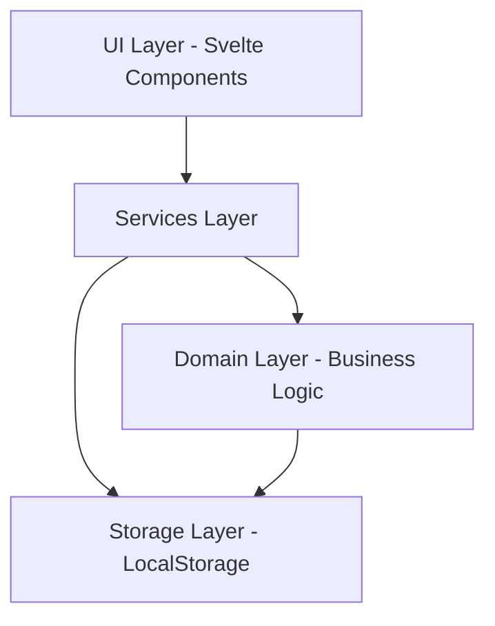

# Architecture Overview

Touch typing grading web application built with Svelte, following a clean architecture pattern with domain-driven design.

## System Roles

### Instructor User
* Creates typing sessions by pasting text and student names
* Generates unique access codes for each student
* Views aggregated results and statistics
* Data stored in browser's local storage

### Student User
* Accesses session via unique code (no login required)
* Types provided text line-by-line
* Receives immediate feedback on errors
* Cannot correct mistakes (line invalidated on error)
* Results sent back to instructor's session

## Core Architecture Layers

### Domain Layer (`src/domain`)
Contains core business entities and logic:
* **Session**: Represents a typing practice session with text and students
* **Student**: Individual participant with unique code and results
* **TypingLine**: Single line of text to be typed
* **TypingAttempt**: Student's attempt at typing a line
* **SessionResults**: Aggregated statistics (WPM, accuracy)

### Services Layer (`src/services`)
Orchestrates business operations:
* **SessionService**: Create/manage sessions, generate student codes
* **TypingService**: Validate typing input, calculate metrics
* **StorageService**: Persist and retrieve session data from localStorage

### UI Layer (`src/ui`)
Svelte components organized by role:
* **pages/**: Route-level components
  * `InstructorSetup.svelte`: Create session, paste text, add students
  * `InstructorDashboard.svelte`: View live results and statistics
  * `StudentTyping.svelte`: Main typing interface for students
* **components/**: Reusable UI elements
  * `TypingLine.svelte`: Single line display with error handling
  * `StudentCodeInput.svelte`: Code entry for students
  * `ResultsTable.svelte`: Display student statistics

### Storage Layer (`src/connections`)
* **LocalStorageAdapter**: Handles browser localStorage operations
* Data structure: Sessions keyed by instructor session ID
* Student progress synced to instructor's storage

## Key Technical Decisions

* **No backend**: Pure client-side application using localStorage
* **Code-based access**: Students use generated codes instead of authentication
* **Strict error policy**: Any mistake invalidates the entire line
* **Real-time feedback**: Immediate visual indication of errors
* **German UI**: User-facing text in German, code/comments in English

## Data Flow

### Session Creation (Instructor)
1. Instructor pastes text and student names
2. System generates unique session ID and student codes
3. Session data stored in instructor's localStorage
4. Codes displayed for distribution to students

### Typing Practice (Student)
1. Student enters code → retrieves session from instructor's storage
2. System displays first line
3. Student types → character-by-character validation
4. On error → line struck through, "Mistake, press ENTER" shown
5. On Enter → record attempt (success/failure, time, WPM)
6. Move to next line
7. On completion → save results to instructor's session

### Results Viewing (Instructor)
1. Dashboard polls localStorage for updates
2. Displays per-student metrics: lines completed, accuracy %, WPM
3. Shows aggregated statistics across all students

---

relates_to [[Domain Model]]
relates_to [[Coding standards]]
relates_to [[User Flows]]
relates_to [[Data Model]]

## Architecture Overview
# Architecture Overview

Touch typing grading web application built with Svelte, following clean architecture with domain-driven design.

## System Roles

* **Instructor**: Creates sessions, generates student codes, views results
* **Student**: Accesses via code, types text, receives feedback

## Core Layers

* **Domain**: Business entities and logic (Session, Student, TypingAttempt, Results)
* **Services**: Orchestration (SessionService, TypingService, StorageService)
* **Storage**: LocalStorage adapter
* **UI**: Svelte components (pages and reusable components)

## Key Decisions

* No backend - pure client-side with localStorage
* Code-based access - 6-character codes instead of login
* Strict error policy - any mistake invalidates entire line
* Real-time updates - dashboard polls every 2 seconds
* German UI - user text in German, code/comments in English

## Data Flow

* **Session Creation**: Instructor pastes text + names → generates codes → stores in localStorage
* **Typing Practice**: Student enters code → types lines → validates characters → records attempts
* **Results**: Dashboard polls localStorage → calculates metrics → displays statistics

---

relates_to [[MVP Scope]]
relates_to [[Domain Model]]