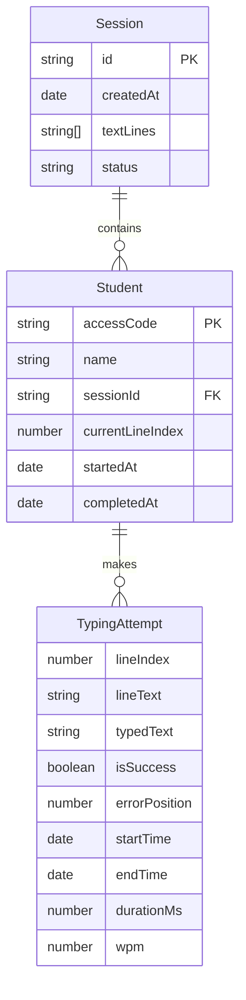

# Domain Model

Core business entities and their relationships for the touch typing application.

## Entity Definitions

### Session
Represents a typing practice session created by an instructor.

```typescript
interface Session {
  id: string;                    // Unique session identifier (UUID)
  createdAt: Date;               // Session creation timestamp
  textLines: string[];           // Array of text lines to be typed
  students: Student[];           // List of enrolled students
  status: 'active' | 'completed'; // Session state
}
```

**Business Rules**:
* Session ID must be unique and generated on creation
* Text lines cannot be empty
* At least one student must be enrolled
* Session becomes 'completed' when all students finish or instructor closes it

### Student
Represents a participant in a typing session.

```typescript
interface Student {
  name: string;                  // Student's display name
  accessCode: string;            // Unique 6-character code (e.g., "ABC123")
  sessionId: string;             // Reference to parent session
  attempts: TypingAttempt[];     // All typing attempts made
  currentLineIndex: number;      // Current line being typed (0-based)
  startedAt?: Date;              // When student started typing
  completedAt?: Date;            // When student finished all lines
}
```

**Business Rules**:
* Access code must be unique within a session
* Access code format: 6 uppercase alphanumeric characters
* Student name must not be empty
* currentLineIndex cannot exceed textLines length

### TypingAttempt
Records a single attempt at typing a line.

```typescript
interface TypingAttempt {
  lineIndex: number;             // Which line was attempted (0-based)
  lineText: string;              // The original text to be typed
  typedText: string;             // What the student actually typed
  isSuccess: boolean;            // True if typed correctly, false if error occurred
  errorPosition?: number;        // Character position where first error occurred
  startTime: Date;               // When typing started for this line
  endTime: Date;                 // When Enter was pressed
  durationMs: number;            // Time taken in milliseconds
  wpm: number;                   // Words per minute for this attempt
}
```

**Business Rules**:
* isSuccess is true only if typedText exactly matches lineText
* errorPosition is set only when isSuccess is false
* WPM calculation: `(characters / 5) / (durationMs / 60000)`
* durationMs must be positive

### SessionResults
Aggregated statistics for a student or entire session.

```typescript
interface SessionResults {
  studentName: string;
  totalLines: number;            // Total lines in session
  completedLines: number;        // Lines typed (success or failure)
  successfulLines: number;       // Lines typed without errors
  failedLines: number;           // Lines with errors
  accuracyPercent: number;       // (successfulLines / completedLines) * 100
  averageWpm: number;            // Average WPM across successful attempts
  fastestWpm: number;            // Highest WPM achieved
  totalTimeSeconds: number;      // Total time spent typing
}
```

**Business Rules**:
* accuracyPercent calculated only from completed lines
* averageWpm calculated only from successful attempts
* If no successful attempts, averageWpm and fastestWpm are 0

## Entity Relationships



## Domain Operations

### Session Creation
* Generate unique session ID
* Parse text into lines (split by newline)
* Generate unique access codes for each student
* Initialize students with empty attempts array
* Set status to 'active'

### Typing Validation
* Compare typed character with expected character at position
* On mismatch: mark line as failed, record error position
* On Enter: create TypingAttempt record
* Calculate WPM based on line length and duration
* Advance to next line

### Results Calculation
* Aggregate all attempts for a student
* Calculate accuracy percentage
* Compute average WPM from successful attempts only
* Determine fastest WPM achieved

## Validation Rules

### Text Input
* Minimum 1 line required
* Maximum 1000 lines per session
* Each line: 1-200 characters
* Preserve original whitespace and formatting

### Student Names
* Minimum 1 character
* Maximum 50 characters
* No duplicate names within a session

### Access Codes
* Format: `[A-Z0-9]{6}`
* Must be unique across all active sessions
* Case-insensitive for entry (converted to uppercase)

---

relates_to [[Architecture Overview]]
relates_to [[Coding standards]]
relates_to [[Data Model]]

## Domain Model
# Domain Model

Core business entities for the touch typing application.

## Entities

### Session
* Unique ID (UUID)
* Creation timestamp
* Array of text lines
* Array of students
* Status (active/completed)

### Student
* Name
* Unique 6-character access code
* Reference to session
* Array of typing attempts
* Current line index
* Start/completion timestamps

### TypingAttempt
* Line index and text
* Typed text
* Success/failure flag
* Error position (if failed)
* Start/end timestamps
* Duration in milliseconds
* WPM (words per minute)

### SessionResults
* Student name
* Total/completed/successful/failed line counts
* Accuracy percentage
* Average/fastest WPM
* Total time

## Validation Rules

* Text: 1-1000 lines, 1-200 chars per line
* Student names: 1-50 chars, no duplicates
* Access codes: `[A-Z0-9]{6}`, unique across sessions
* WPM: `(characters / 5) / (durationMs / 60000)`

---

relates_to [[Architecture Overview]]
relates_to [[MVP Scope]]