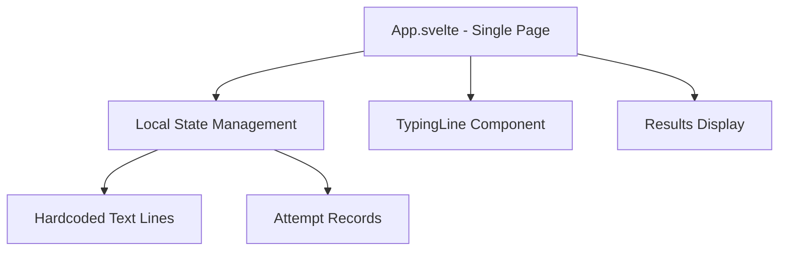
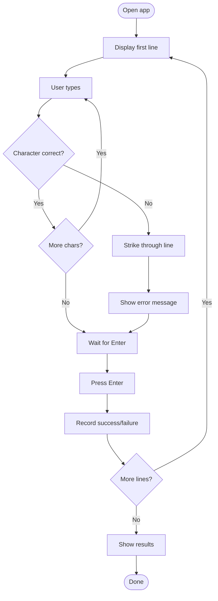

# MVP Scope - Minimal Viable Product

## Core Value Proposition

A single student can practice typing a predefined text line-by-line with immediate error feedback and see their results.

## MVP Features (Absolute Minimum)

### What's IN the MVP

1. **Single Student Mode**
   * No instructor setup
   * No access codes
   * Hardcoded text (3-5 sample lines)
   * One user at a time

2. **Basic Typing Interface**
   * Display one line at a time
   * Type character-by-character
   * On error: Strike through line, show "Fehler, ENTER drücken"
   * On Enter: Move to next line
   * No backspace allowed

3. **Simple Results**
   * At end: Show count of successful vs failed lines
   * Show basic accuracy percentage
   * No WPM calculation (simplifies timing logic)

4. **Minimal UI**
   * Single page application
   * No routing
   * Basic styling (no Tailwind, just CSS)
   * German text

### What's OUT of MVP (Future Phases)

* ❌ Instructor role
* ❌ Multiple students
* ❌ Access codes
* ❌ Session creation
* ❌ Custom text input
* ❌ LocalStorage persistence
* ❌ Dashboard/monitoring
* ❌ WPM calculation
* ❌ Timing metrics
* ❌ Results export
* ❌ Routing
* ❌ Complex styling

## MVP Architecture (Simplified)



### File Structure (Minimal)

```
zeilenschreiben/
├── src/
│   ├── App.svelte           # Main component with all logic
│   ├── TypingLine.svelte    # Line display with error state
│   └── app.css              # Basic styles
├── index.html
├── package.json
└── vite.config.js
```

## MVP User Flow



## MVP Implementation Steps

### Phase 1: Basic Setup (30 min)
1. Initialize Vite + Svelte project
2. Create basic file structure
3. Add hardcoded text lines

### Phase 2: Typing Logic (1-2 hours)
4. Implement character-by-character validation
5. Handle Enter key to advance lines
6. Track successful vs failed attempts
7. Prevent backspace

### Phase 3: Visual Feedback (1 hour)
8. Display current line with typed overlay
9. Strike-through on error
10. Show error message
11. Basic styling

### Phase 4: Results (30 min)
12. Calculate accuracy percentage
13. Display final results
14. Add restart button

## MVP Success Criteria

* ✅ User can type through 5 predefined lines
* ✅ Errors are immediately visible (strike-through)
* ✅ Cannot correct mistakes (backspace disabled)
* ✅ Must press Enter to continue after error
* ✅ Final screen shows: X successful, Y failed, Z% accuracy
* ✅ Can restart and try again

## MVP Data Model (Simplified)

```typescript
// No complex entities, just simple state
interface AppState {
  lines: string[];              // Hardcoded text
  currentLineIndex: number;     // Which line (0-based)
  typedText: string;            // Current typed text
  hasError: boolean;            // Error state
  attempts: boolean[];          // true = success, false = failure
  isComplete: boolean;          // All lines done
}
```

## MVP Code Estimate

* [`App.svelte`](src/App.svelte): ~150 lines (state + logic + layout)
* [`TypingLine.svelte`](src/TypingLine.svelte): ~50 lines (display + styling)
* [`app.css`](src/app.css): ~50 lines (basic styles)
* **Total: ~250 lines of code**

## Post-MVP Roadmap

### Phase 2: Multi-Student Support
* Add instructor setup page
* Generate access codes
* LocalStorage for sessions

### Phase 3: Metrics & Dashboard
* Add WPM calculation
* Timing per line
* Instructor dashboard

### Phase 4: Polish
* Tailwind CSS
* Better UX
* Export results

---

relates_to [[Architecture Overview]]
relates_to [[Domain Model]]
relates_to [[Implementation Plan]]