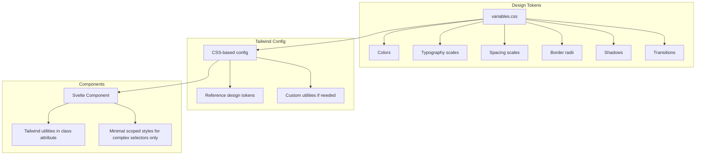

# Styling Strategy: Tailwind-First with Design Tokens

## Overview

This document proposes a maintainable styling architecture that fully embraces Tailwind CSS for utility-based styling while using CSS custom properties (variables) exclusively for design tokens.

## Current State Analysis

### Problems Identified

1. **Inconsistent approach**: Some components use Tailwind utilities in templates, others use CSS variables in `<style>` blocks
2. **Hardcoded values**: Colors like `rgba(33, 150, 243, 0.2)` appear directly in component styles instead of using tokens
3. **Tailwind underutilized**: Only [`TypingLine.svelte`](../src/ui/components/TypingLine.svelte:22) uses Tailwind classes, and minimally
4. **No clear guidelines**: Developers don't know when to use which approach
5. **Tailwind not properly configured**: Missing Tailwind v4 setup with CSS-based configuration

---

## Proposed Architecture



---

## Layer 1: Design Tokens (CSS Variables)

Design tokens are the **single source of truth** for visual design decisions. They live in [`src/variables.css`](../src/variables.css).

### What belongs in design tokens

| Category | Examples | Rationale |
|----------|----------|-----------|
| **Colors** | `--color-primary`, `--color-error`, `--color-text-primary` | Brand identity, theming, dark mode |
| **Typography** | `--font-mono`, `--font-size-lg` | Consistent type scale |
| **Spacing** | `--spacing-sm`, `--spacing-lg` | Rhythm and layout consistency |
| **Borders** | `--border-radius`, `--border-width` | Visual consistency |
| **Effects** | `--transition-fast`, `--opacity-muted` | Animation and state consistency |

### What does NOT belong in design tokens

- Layout utilities (flexbox, grid) → Use Tailwind
- Responsive breakpoints → Use Tailwind
- One-off component-specific values → Use Tailwind arbitrary values

### Proposed token structure

```css
/* src/variables.css */
:root {
  /* === Colors === */
  /* Primary palette */
  --color-primary: #2196f3;
  --color-primary-hover: #1976d2;
  --color-primary-muted: rgba(33, 150, 243, 0.2);
  
  /* Semantic colors */
  --color-success: #4caf50;
  --color-error: #d32f2f;
  --color-error-muted: #ff6b6b;
  
  /* Text colors */
  --color-text: #333;
  --color-text-muted: #666;
  --color-text-subtle: #999;
  
  /* Surface colors */
  --color-surface: #ffffff;
  --color-surface-elevated: #f5f5f5;
  --color-background: #e8e8e8;
  
  /* === Typography === */
  --font-mono: 'Courier New', monospace;
  --font-sans: system-ui, -apple-system, sans-serif;
  
  /* === Spacing === */
  /* Using a consistent scale */
  --spacing-1: 0.25rem;  /* 4px */
  --spacing-2: 0.5rem;   /* 8px */
  --spacing-3: 0.75rem;  /* 12px */
  --spacing-4: 1rem;     /* 16px */
  --spacing-6: 1.5rem;   /* 24px */
  --spacing-8: 2rem;     /* 32px */
  --spacing-12: 3rem;    /* 48px */
  
  /* === Borders === */
  --radius-sm: 4px;
  --radius-md: 8px;
  --radius-lg: 12px;
  
  /* === Transitions === */
  --duration-fast: 150ms;
  --duration-normal: 300ms;
}

/* Dark mode */
@media (prefers-color-scheme: dark) {
  :root {
    --color-text: #ffffff;
    --color-text-muted: #cccccc;
    --color-text-subtle: #666666;
    --color-surface: #2a2a2a;
    --color-surface-elevated: #333333;
    --color-background: #1a1a1a;
  }
}
```

---

## Layer 2: Tailwind Configuration

Tailwind v4 uses CSS-based configuration. We configure Tailwind to reference our design tokens.

### Tailwind v4 setup

Create `src/app.css` as the main entry point:

```css
/* src/app.css */
@import "tailwindcss";
@import "./variables.css";

/* Map design tokens to Tailwind theme */
@theme {
  /* Colors */
  --color-primary: var(--color-primary);
  --color-primary-hover: var(--color-primary-hover);
  --color-primary-muted: var(--color-primary-muted);
  --color-success: var(--color-success);
  --color-error: var(--color-error);
  --color-error-muted: var(--color-error-muted);
  
  /* Text colors */
  --color-text: var(--color-text);
  --color-text-muted: var(--color-text-muted);
  --color-text-subtle: var(--color-text-subtle);
  
  /* Surface colors */
  --color-surface: var(--color-surface);
  --color-surface-elevated: var(--color-surface-elevated);
  --color-background: var(--color-background);
  
  /* Font families */
  --font-mono: var(--font-mono);
  --font-sans: var(--font-sans);
  
  /* Border radius */
  --radius-sm: var(--radius-sm);
  --radius-md: var(--radius-md);
  --radius-lg: var(--radius-lg);
  
  /* Transitions */
  --transition-timing-fast: var(--duration-fast);
  --transition-timing-normal: var(--duration-normal);
}

/* Base styles */
@layer base {
  body {
    @apply bg-background text-text;
    font-family: var(--font-sans);
  }
}
```

---

## Layer 3: Component Styling Guidelines

### Primary approach: Tailwind utilities in class attributes

```svelte
<!-- ✅ GOOD: Tailwind utilities for layout, spacing, typography -->
<div class="flex flex-col gap-4 p-6 bg-surface-elevated rounded-md">
  <h2 class="text-xl font-bold text-text">Title</h2>
  <p class="text-text-muted">Description</p>
</div>
```

### When to use scoped `<style>` blocks

Only use scoped styles for:

1. **Complex selectors** that Tailwind cannot express
2. **Animations** with `@keyframes`
3. **Pseudo-elements** (`::before`, `::after`)
4. **Third-party component overrides**

```svelte
<!-- ✅ GOOD: Scoped styles for complex pseudo-element -->
<div class="active-line flex items-start gap-4 p-4 rounded-md">
  <slot />
</div>

<style>
  /* Complex overlay effect requiring pseudo-element */
  .active-line::before {
    content: '';
    position: absolute;
    inset: 0;
    background-color: var(--color-primary-muted);
    border: 2px solid var(--color-primary);
    border-radius: var(--radius-md);
    pointer-events: none;
  }
</style>
```

### What to avoid

```svelte
<!-- ❌ BAD: Duplicating Tailwind functionality in scoped styles -->
<div class="container">
  <p>Text</p>
</div>

<style>
  .container {
    display: flex;
    flex-direction: column;
    gap: 1rem;
    padding: 1.5rem;
  }
</style>

<!-- ❌ BAD: Hardcoded values instead of tokens -->
<style>
  .highlight {
    background-color: rgba(33, 150, 243, 0.2); /* Should use var(--color-primary-muted) */
  }
</style>
```

---

## Migration Path

### Phase 1: Setup Tailwind v4 properly

1. Configure `src/app.css` with `@import "tailwindcss"` and `@theme` block
2. Consolidate design tokens in `src/variables.css`
3. Remove duplicate/hardcoded values

### Phase 2: Migrate components incrementally

For each component:

1. Replace scoped CSS with Tailwind utilities where possible
2. Keep scoped styles only for complex selectors
3. Replace hardcoded values with design tokens

**Example migration for [`ActiveLine.svelte`](../src/ui/components/ActiveLine.svelte)**:

Before:
```svelte
<div class="active-line">
  <div class="active-line-bg"></div>
  <div class="active-line-content">
    <slot />
  </div>
</div>

<style>
  .active-line {
    position: relative;
    padding: var(--spacing-sm);
    display: flex;
    align-items: flex-start;
    gap: var(--spacing-sm);
    border-radius: var(--border-radius);
  }
  /* ... more styles */
</style>
```

After:
```svelte
<div class="relative flex items-start gap-4 p-4 rounded-md">
  <!-- Background overlay requires pseudo-element, kept in scoped style -->
  <div class="active-line-bg"></div>
  <div class="relative z-10">
    <slot />
  </div>
</div>

<style>
  .active-line-bg {
    @apply absolute inset-0 rounded-md pointer-events-none;
    background-color: var(--color-primary-muted);
    border: 2px solid var(--color-primary);
  }
</style>
```

### Phase 3: Document and enforce

1. Update [`Coding standards.md`](../basic-memory/Coding%20standards.md) with styling guidelines
2. Add ESLint/Prettier rules if available for Tailwind class ordering
3. Create component examples in documentation

---

## Decision Summary

| Concern | Approach |
|---------|----------|
| **Colors, typography, spacing values** | CSS variables in `variables.css` |
| **Layout, positioning, responsive** | Tailwind utilities |
| **Component-specific styling** | Tailwind utilities in `class` attribute |
| **Complex selectors, animations** | Scoped `<style>` blocks referencing tokens |
| **Dark mode** | CSS variables with `@media (prefers-color-scheme)` |

---

## Benefits

1. **Consistency**: Single source of truth for design decisions
2. **Discoverability**: Tailwind classes are self-documenting in templates
3. **Maintainability**: Changes to tokens propagate everywhere
4. **Onboarding**: Clear rules for newcomers - "use Tailwind, reference tokens"
5. **Theming**: Easy dark mode and future theme support via CSS variables
6. **Performance**: Tailwind's purging removes unused styles

---

## Decisions Made

1. **Dark mode**: Use CSS `prefers-color-scheme` (automatic, no JS needed)
2. **Custom plugins**: Not needed for MVP - evaluate as project grows
3. **Class ordering**: Recommended convention: layout → spacing → typography → colors → states
